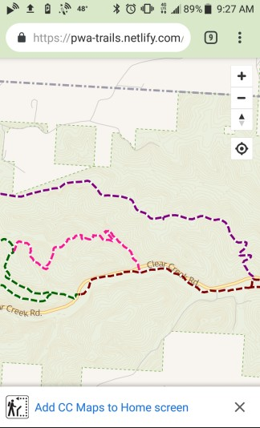
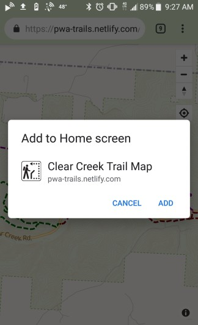
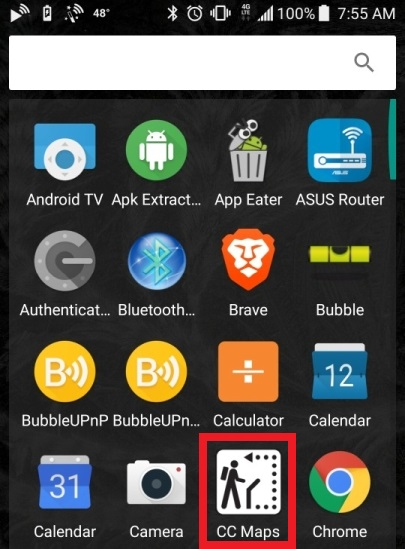
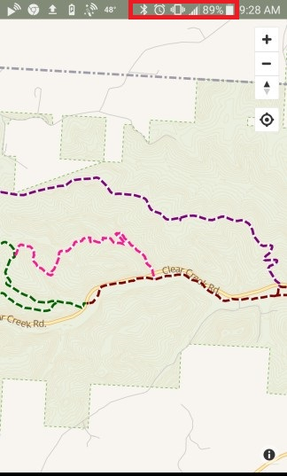
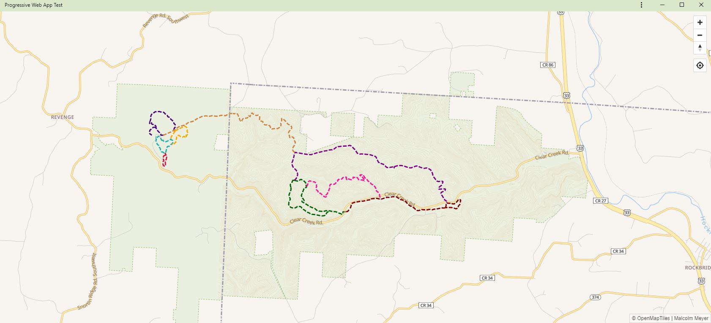
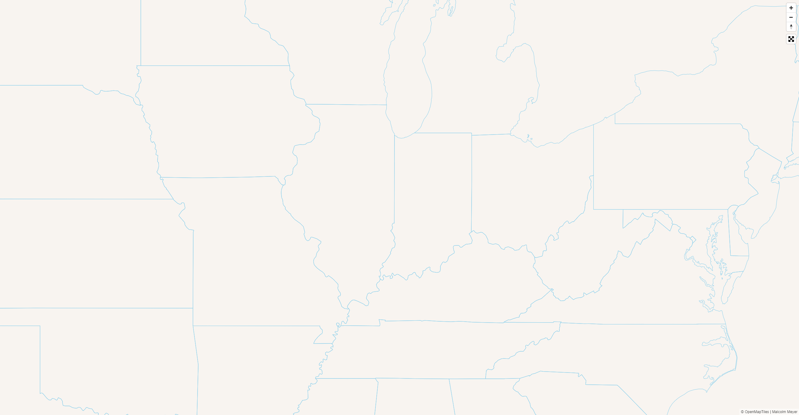

## [Progressive <br>Web ~~Apps~~ Maps (PWA)]()

Malcolm Meyer

GIS Specialist | 
[City of Zanesville](https://gis.coz.org)

## [Goals](#2)

<ul style="none;">
<h4>Overview of PWAs</h4>
<h4>Create a Basic Web Map</h4>
<h4>Turn this Map into a PWA</h4>
<h4>Make the PWA Installable</h4>
<h4>Allow the PWA to be used Offline</h4>
<h4>Host & Install the PWA</h4>
</ul>

## What is a PWA
> Set of components to allow a website to behave more like a native application

## Benefits
Native App Behaviors

Custom App Colors

Caching & Offline Support

*Push Notifications

## Multi-Platform
Android

Chrome

Chromebooks

iOS

Windows Store

## Examples

<iframe src="https://www.pwastats.com" width="100%" height="500px"></iframe>

---



---



---



---


---



---


## <span style="color:skyblue;">Code Break</span>

Notes: https://www.smashingmagazine.com/2016/02/making-a-service-worker/

## <span style="color:skyblue;">Step 1. Install</span>

```
/**
Download the pwa-maps repo zip file at
https://github.com/reyemtm/pwa-maps/archive/master.zip
unzip and open the folder with VS Code
CTRL + '`' to open the terminal
*/
```

```
npm install
```

```
npm run build

```

```
npm start
```

Notes: Installs some dependencies and copies a basic webmap to the public folder

## <span style="color:skyblue;">Step 2. Test</span>




Note: We have a basic webmap, but the manifest.json and service worker fail to load, however some tests in the Audit PWA test will pass

## [Goals](#2)

<ul style="none;">
<h4>Overview of PWAs</h4>
<h4>Create a Basic Web Map</h4>
<h4>Turn this Map into a PWA</h4>
<h4>Make the PWA Installable</h4>
<h4>Allow the PWA to be used Offline</h4>
<h4>Host & Install the PWA</h4>
</ul>

## <span style="color:firebrick;">Errors!!</span>

```
CTRL + SHIFT + i then Audit Tab
```

Progressive Web App Audit in Chrome
* No manifest
* No service worker

Check 'Offline' in the Applcation Tab
* App does not work offline

## Let's Look at the Elements of a PWA
- manifest.json
- service-worker.js
- *Mobile First Design
- *Progressive Enhancement

## Adding the manifest.json
```
https://app-manifest.firebaseapp.com/
```

```
{
  "name": "Clear Creek Trail Map",
  "short_name": "CC Maps",
  "scope": "/",
  "start_url": "/",
  "icons": [
    {
      "src": "/img/trails512.png",
      "type": "image/png",
      "sizes": "512x512"
    }
  ],
  "background_color": "#d8e8c8",
  "theme_color": "#d8e8c8",
  "display": "standalone"
}

```

## <span style="color:skyblue;">Test Again</span>

* Passes manifest tests
* No service-worker
* No offline support

## Let's add the<br>service-worker
* Created manually or with build tools

## service-worker.js

```
create an empty service-worker.js file in the root of 'public'
```

```
<!--register the service worker-->
<script>
  if ('serviceWorker' in navigator) {
    navigator.serviceWorker
      .register('/service-worker.js')
      .then(function () {
        console.log("Service Worker Registered");
      });
  }
</script>
```

## <span style="color:#28a745;">Success!</span>
* Installable
* PWA Optimized
* Still no offline support
* No service worker caching

## Adding Offline Cache

[https://css-tricks.com/serviceworker-for-offline/](https://css-tricks.com/serviceworker-for-offline/)

## get a basic map working
## turn this map into a PWA
## you can use any map API, we will be using Mapbox
## anyone have custom data?
## create custom basemap data
## need to add our map style (basemap)
## copy fonts, vector tiles and style
## test our map is working
## test pwa with application tab
## need to create manifest json
## test manifest json with application tab
## write basic service worker
## test our app offline
## use sw-precache
## test offline again
## publish app to netlify


## Creating the Basemap

## OpenMapTiles
``https://openmaptiles.com/downloads/tileset/osm/north-america/us/ohio/``

## Create an Extract
- GeoJSON to clip OpenMapTiles
- Node JS Package ``mbtiles-extracts``
- Edit to allow for not passing in a property name
- Unpack raw vector tiles from mbtiles
  - Then use https://www.npmjs.com/package/mbtiles2ungzpbf to extract the tiles from the mbtiles file

## Map Data

### GeoJSON

- Convert your data to GeoJSON
- ``Feature to JSON`` or ``esri2open`` or ``mapshaper`` or ``QGIS Save As`` ...

## Build Your Map

- Leaflet, Mapbox, OpenLayers, Esri JS API
- Depends on your platform, we will use Mapbox Style Spec

## Take it Offline
- Verify all resources needed for offline use
- Install Node JS package ``swprecache``
- Run the precache tool to create your service worker
- Create your ``manifest.json`` file

## A Basic Webpage
```
<!DOCTYPE html>
<html lang="en">
<head>
  <meta charset="UTF-8">
  <meta name="viewport" content="width=device-width, initial-scale=1.0">
  <meta http-equiv="X-UA-Compatible" content="ie=edge">
  <title>Document Title</title>
  <!-- css and js -->
</head>
<body>
  
</body>
</html>
```
